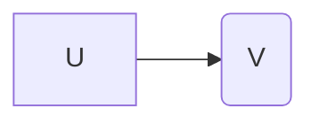

#### 什么是拓扑排序？

> 即：对于任何有向图而言，其拓扑排序为其所有结点的一个线性排序（对于同一个有向图而言可能存在多个这样的结点排序）。

该排序满足这样的条件——对于图中的任意两个结点 u和 v，若存在一条有向边从 u指向 v，则在拓扑排序中 u一定出现在 v前面。



其拓扑排序为：`... u ... v ...`，u一定在 v的前面。拓扑排序主要用来解决 <font color=red>有向图中的依赖解析</font>（dependency resolution）问题。

举例来说，如果我们将一系列需要运行的任务构成一个有向图，图中的有向边则代表某一任务必须在另一个任务之前完成这一限制。那么运用拓扑排序，我们就能得到满足执行顺序限制条件的一系列任务所需执行的先后顺序。当然也有可能图中并不存在这样一个拓扑顺序，这种情况下我们无法根据给定要求完成这一系列任务，这种情况称为循环依赖（circular dependency）。

##### 拓扑排序存在的前提：

- 图是有向图
- 图是无环图

#### 拓扑排序的算法和实现

节点 v入度：指向 v节点的边数。

节点 v出度：从 v节点指向其他节点的边数。

##### 初始化有向无环图

定义节点 V：

```java
@Data
@AllArgsConstructor
@NoArgsConstructor
static class Node {
    /**
     * 图节点名称
     */
    private String nodeName;
    /**
     * 图节点入度
     */
    private Integer inDegree;
    /**
     * 图节点出度
     */
    private Integer outDegree;
    /**
     * 图节点指向的节点集合，其 nextNodeList.size() == outDegree
     */
    private List<Node> nextNodeList;
}
```

对于图某边关系 A->B，若 A和 B不存在，则新建。A的出度 + 1，B的入度 + 1，将 B加入到 A的 nextNodeList属性里。

```java
private static List<Node> initGraph() {
    Map<String, Node> nodeMap = new HashMap<>(4);
    while (true) {
        Scanner scanner = new Scanner(System.in);
        System.out.println("请输入图中相邻节点的关系，A->B，请输入 A#B，结束请输入 #");
        String line = scanner.nextLine();
        if ("#".equals(line)) {
            break;
        }
        String[] names = line.split("#");
        if (names.length != 2) {
            continue;
        }
        String fromName = names[0];
        String toName = names[1];
        Node fromNode = nodeMap.containsKey(fromName) ? nodeMap.get(fromName) : new Node(fromName, 0, 0,new ArrayList<>());
        Node toNode = nodeMap.containsKey(toName) ? nodeMap.get(toName) : new Node(toName, 0, 0, newArrayList<>());
        // 出度加 1
        fromNode.setOutDegree(fromNode.getOutDegree() + 1);
        // 入度加 1
        toNode.setInDegree(toNode.getInDegree() + 1);
        List<Node> nextNodeList = fromNode.getNextNodeList();
        nextNodeList.add(toNode);
        fromNode.setNextNodeList(nextNodeList);
        nodeMap.put(fromName, fromNode);
        nodeMap.put(toName, toNode);
    }
    List<Node> nodeList = new ArrayList<>();
    nodeList.addAll(nodeMap.values());
    return nodeList;
}
```

根据上面初始化好的数据，进行拓扑排序：

1. 查找图中入度为 0的节点，查找到进行第 2步；查找不到，则证明存在闭环，结束。
2. 获取该节点的 nextNodeList属性，并分别将它们的入度 - 1，再将该节点从图中移除点，并将其放入到结果中。
3. 若图中还有节点，进行第 1步；没有节点，结束运行。

```java
private static List<String> topologicalSort(List<Node> nodeList) {
    List<String> result = new ArrayList<>();
    while (true) {
        Iterator<Node> iterator = nodeList.iterator();
        Node inDegreeNode = null;
        while (iterator.hasNext()) {
            Node node = iterator.next();
            if (node.getInDegree() == 0) {
                inDegreeNode = node;
                break;
            }
        }
        if (inDegreeNode == null) {
            System.out.println("存在闭环。。。");
            break;
        }
        result.add(inDegreeNode.getNodeName());
        nodeList.remove(inDegreeNode);
        List<String> nodeNameList =inDegreeNode.getNextNodeList().stream().map(Node::getNodeName).collect(Collectors.toList());
        nodeList.forEach(node -> {
            if (nodeNameList.contains(node.getNodeName())) {
                node.setInDegree(node.getInDegree() - 1);
            }
        });
    }
    return result;
}
```

---

#### 举例应用

给定一个城市的地图，所有的道路都是单行道，而且不会构成环。每条道路都有过路费，问您从S点到T点花费的最少费用。


设：起点到 X的花费的最小费用是 `f(X) = f(Y) + value`。其中 Y可以直接到达 X，value是 Y到 X的路道费用。

那么，图中起点 S到终点 T的最小过路费用是：

    f(T) = MIN(f(C) + 20, f(D) + 10);

验证是否能用 DP解决：

- 无后效性：f(T)依赖于 f(C)和 f(D)的值，但是不关心他们是怎么计算出来的，满足。
- 最优子结构: 参考函数 f的定义，满足。

由于图中存在依赖关系，例如 D依赖于 A, B, C三点，在计算 D之前，一定要先计算出 A, B, C三点。所以要利用拓扑排序将其变为线性结构，来确保数据计算顺序的正确性。

```
// 初始化有向无环图
List<Node> nodeList = initGraph();
// 进行拓扑排序，变为线性结构
// S B A C D T
List<String> result = topologicalSort(nodeList);

f(S) = 0;
f(B) = f(S) + 20 = 20;
f(A) = f(S) + 10 = 10;
f(C) = f(A) + 30 = 40;
f(D) = MIN(f(A) + 10, f(C) + 5, f(B) + 20) = 20;
f(T) = MIN(f(C) + 20, f(D) + 10) = 30;
```